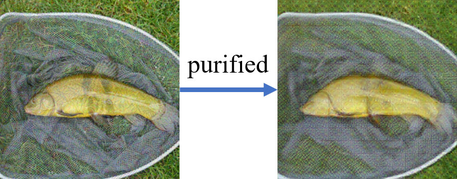

# Adversarial Purification of Information Masking

PyTorch implementation of "Adversarial Purification of Information Masking"

## Configuration

```shell
pip3 install -r requirements.txt
# Add project path to PYTHONPATH
export PYTHONPATH=<project_path>:$PYTHONPATH
```

## Weights

| Name        | Download |
|-------------| ----------- |
| IMPure      | [baidupan](https://pan.baidu.com/s/1Iy1xkEQm7wpDoh0PouNBkA?pwd=21bg) |
| pre-trained | [baidupan](https://pan.baidu.com/s/1hDbgTVZ9sUAyB4anozEEPQ?pwd=pjv9) |

## Demo

You can quickly get a purified image by downloading our trained weights.



````shell
python3 data_process/demo.py \
--resume <checkpoint_path> \
--img_path ./demo/ILSVRC2012_val_00007197.png \
--save_path ./demo/puri_ILSVRC2012_val_00007197.png
````

## Prepare dataset

### Verify target model

We need to record images from the ImageNet dataset that the target model can correctly classify.

You need to modify the following variables in the file:

 - `model_name`: The name of the target model, such as: resnet101_v2, inceptionv3_v1, inceptionresnetv2_v1

 - `root_path`: The root directory of the ImageNet dataset.

 - `save_path`: The path to save the result file.

```shell
python3 data_process/model_val.py
```

The result will be saved in a json file like this:

```json
[
  ["./train/n01440764/n01440764_449.JPEG", 0], 
  ["./train/n01440764/n01440764_9390.JPEG", 0], 
  ["./train/n01440764/n01440764_5941.JPEG", 0], 
  ...
]
```

### Generate adversarial examples

Use `data_process/adv_attack.py` to quickly generate adversarial samples

```shell
python data_process/adv_attack.py \
--model inceptionv3_v1 --attack FGSM \
--attack_param "{\"eps\": 16}" --data_split val \
--attack_path <save path> \
--filter_data <filter_json> \
--device "cuda:4" --input_size 299
```

Please refer to `shell/attack_*.sh`

### Pre-training Script

Please refer to `shell/pretrain.sh`

### Training Script

Please refer to `shell/advpuri_mipure_train.sh`

### Testing Script

Please refer to `shell/advpuri.sh` or `shell/adv_attack_val.sh`


